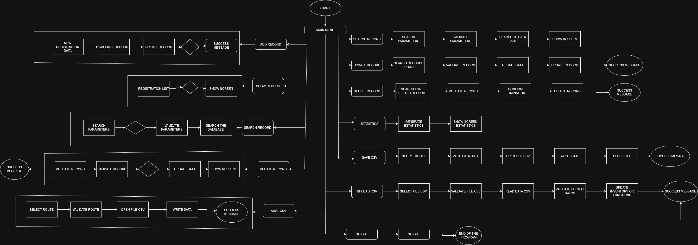

# Project  - Week 3

This repository contains the logic and structure developed during the third week of the project.

#  Flowchart
The following diagram represents the core logic and workflow of the application:



---

#  Project Structure

A brief description of the files included in this workspace:

* **`app.py`**: The main entry point of the application.
* **`base.py`**: Contains core logic and base class definitions.
* **`services.py`**: Handles external integrations and business services.
* **`generador.py`**: Responsible for data or file generation processes.
* **`files.py`**: Utility functions for file handling and I/O operations.
* **`Diagrama.drawio.png`**: Visual representation of the system's architecture.

---

#  Getting Started


# Installation & Execution
1. Clone the repository:
   ```bash
   git clone [https://github.com/carlospina2/semana3.git](https://github.com/carlospina2/semana3.git)